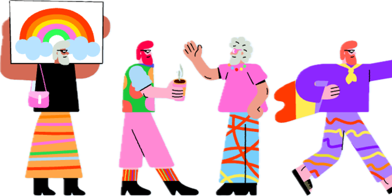

# Skill Exchange Platform

A full-stack web application for matching users to exchange skills and learn from each other.

## Problem Statement

Learning new skills can be lonely, costly, and hard to stay motivated. Especially without guidance and support. While many people are eager to share what they know, there's no simple, peer-based way to connect based on shared interests and skills.
Most platforms are built for content delivery, not human connection.
But what if learning felt more like meeting a friend than taking a class?
This project aims to solve that by creating a user-friendly Skill Exchange App, where users match by what they want to learn and teach, then connect, chat, and support each other. 
It makes learning social, fun, and free. Inspired by social matching platforms, the app helps people find partners with complementary skills and shared interests. 
By fostering mutual support and peer-to-peer learning, it turns learning into a social, rewarding experience.

## Project Structure

- `backend/` — Flask, SQLAlchemy, PostgreSQL API
- `frontend/` — React web client
- `docs/` — Documentation

## Quick Start

- **Backend setup:** See [backend/README.md](backend/README.md)
- **Frontend setup:** See [frontend/README.md](frontend/README.md)

## Documentation

- [API Reference](docs/API.md)
- [Database Schema](docs/DATABASE.md)
- [AI Integration](docs/SETUP_AI.md)

---

## Demo Screenshots

### Landing Page

### Login or Sign Up

### How It Works

### Profile Page

### Matching Page

### Chat

### Rating

